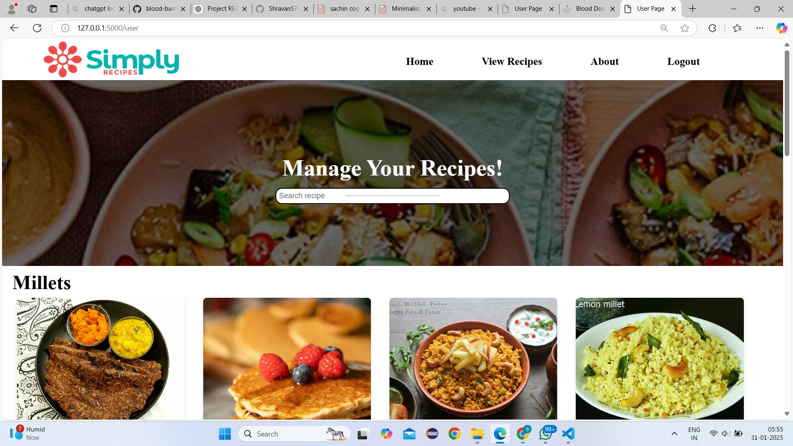

# 🍽️ Recipe Web Application

## 📌 Project Overview
The **Recipe Web Application** is a web-based platform designed to help users explore, share, and manage recipes. It provides an interactive interface for searching and viewing a variety of recipes, making cooking more accessible and enjoyable.

## 🎯 Features
- 📝 Users can browse, search, and view recipes.
- 🔍 Filter recipes based on categories, ingredients, and cuisine.
- 📦 Admin panel for adding and managing recipes.
- 📸 Upload images for recipes.
- 🔐 Secure authentication for users and admins.

## 🖥️ Tech Stack
- **Frontend:** HTML, CSS, JavaScript, Bootstrap
- **Backend:** Python (Django)
- **Database:** MySQL

## 🛠️ Requirements & Dependencies
### 🔧 Hardware Requirements:
- Processor: **Intel Core i5/i7 or Ryzen 5**
- RAM: **8GB+**
- Storage: **128GB+ SSD**



### 📦 Software Requirements:
- Python 3.x
- Django
- MySQL
- HTML, CSS, JavaScript, Bootstrap
- XAMPP (For local MySQL server)

### 📌 Installation & Setup
#### 1️⃣ Clone the repository
```sh
git clone <https://github.com/Anu3328/Mini-project/blob/main/README.md>
cd recipe-web-app
